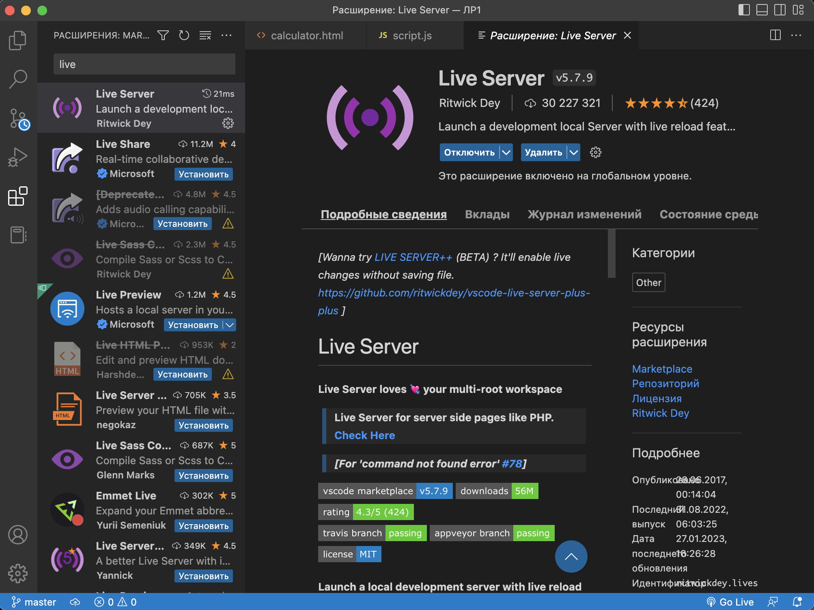

# ЛР 2. Calculator. JavaScript

**Цель** данной лабораторной работы - знакомство с инструментами построения пользовательских интерфейсов web-сайтов: HTML, CSS, JavaScript. В ходе выполнения работы, вам предстоит продолжить реализовывать простой калькулятора,  и затем выполнить задания по варианту.

## План

1. Программирование логики с помощью JavaScript
2. Доступ к HTML-элементам из JavaScript
3. Программирование кнопок калькулятора
4. Запуск калькулятора с помощью LiveServer
5. Задание

## 1. Программирование логики с помощью JavaScript

Язык программирования JavaScript служит основным инструментом для описания логики и интерактивности веб-страниц. В данной работе с помощью Js мы будем программировать кнопки калькулятора.

Как и CSS, js-скрипт можно задать в самом HTML-документе (вложенный скрипт), либо вынести в отдельный файл и сослаться на него в HTML-файле:

```html
<head> 
    <title>калькулятор</title>
    <link rel="stylesheet" href="style.css"> 
    <script type="text/javascript" src="script.js"></script> 
</head>
```

## 2. Доступ к HTML-элементам из JavaScript

Самый распространенный путь доступа к HTML-элементам из скрипта - получение HTML-объекта по его идентификатору. Для этого существует метод `getElementById`:

```html
<body>
    <p id="paragraph">Lorem Ipsum</p>

    <!--вложенный JS-скрипт-->
    <script>
    <!-- обращаемся к HTML-документу и ищем объект с id=paragraph -->
        element = document.getElementById("paragraph")

        <!-- через свойство innerHTML у полученного объекта можно изменить его содержимое-->
        element.innerHTML = "Измененный текст параграфа";
    </script>
</body>
```

Также JS предоставляет и другие методы получения элементов:

```js
document.getElementsByTagName(name) // поиск элементов по тэгу
document.getElementsByClassName(name) // поиск элементов определенного css класса
```

про другие способы взаимодействия с HTML-элементами из JS можно почитать [здесь](https://www.w3schools.com/js/js_htmldom.asp).

## 3. Программирование кнопок калькулятора

```js
// файл script.js
window.onload = function(){ 

let a = ''
let b = ''
let expressionResult = ''
let selectedOperation = null

// окно вывода результата
outputElement = document.getElementById("result")

// список объектов кнопок циферблата (id которых начинается с btn_digit_)
digitButtons = document.querySelectorAll('[id ^= "btn_digit_"]')

function onDigitButtonClicked(digit) {
    if (!selectedOperation) {
        if ((digit != '.') || (digit == '.' && !a.includes(digit))) { 
            a += digit
        }
        outputElement.innerHTML = a
    } else {
        if ((digit != '.') || (digit == '.' && !b.includes(digit))) { 
            b += digit
            outputElement.innerHTML = b        
        }
    }
}

// устанавка колбек-функций на кнопки циферблата по событию нажатия
digitButtons.forEach(button => {
    button.onclick = function() {
        const digitValue = button.innerHTML
        onDigitButtonClicked(digitValue)
    }
});

// установка колбек-функций для кнопок операций
document.getElementById("btn_op_mult").onclick = function() { 
    if (a === '') return
    selectedOperation = 'x'
}
document.getElementById("btn_op_plus").onclick = function() { 
    if (a === '') return
    selectedOperation = '+'
}
document.getElementById("btn_op_minus").onclick = function() { 
    if (a === '') return
    selectedOperation = '-'
}
document.getElementById("btn_op_div").onclick = function() { 
    if (a === '') return
    selectedOperation = '/'
}

// кнопка очищения
document.getElementById("btn_op_clear").onclick = function() { 
    a = ''
    b = ''
    selectedOperation = ''
    expressionResult = ''
    outputElement.innerHTML = 0
}

// кнопка расчёта результата
document.getElementById("btn_op_equal").onclick = function() { 
    if (a === '' || b === '' || !selectedOperation)
        return
        
    switch(selectedOperation) { 
        case 'x':
            expressionResult = (+a) * (+b)
            break;
        case '+':
            expressionResult = (+a) + (+b)
            break;
        case '-':
            expressionResult = (+a) - (+b)
            break;
        case '/':
            expressionResult = (+a) / (+b)
            break;
    }
    
    a = expressionResult.toString()
    b = ''
    selectedOperation = null

    outputElement.innerHTML = a
}
};
```

## 4. Запуск калькулятора с помощью LiveServer

В приложении VS Code зайдите в расширения и установите Live Server.



Отлично! Теперь можно запустить наш калькулятор на сервере, нажав на кнопку **Go Live** на нижней панели.
При изменении кода в файлах страничка на сервере будет автоматически перезагружаться.

## 5. Задание

1. Запрограммируйте операцию смены знака +/-;
2. Запрограммируйте операцию вычисления процента %;
3. Добавьте кнопку стирания введенной цифры назад (backspace). Расположить кнопку можно, например, на месте нерабочих +/- и % кнопок;
4. Сделайте смену цвета фона по кнопке;
5. Запрограммируйте операцию вычисления квадратного корня √;
6. Запрограммируйте операцию возведения в квадрат x²;
7. Запрограммируйте операцию вычисления факториала x!;
8. Добавьте кнопку, которая за раз добавляет сразу три нуля (000);
9. Запрограммируйте накапливаемое сложние;
10. Запрограммируйте накапливаемое вычитание;
11. Сделайте смену цвета окна вывода результата по кнопке.
12. Добавьте в калькулятор вашу индивидуальную операцию
